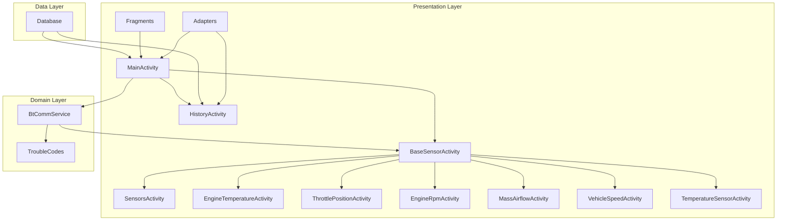

# Autohealth

Мобильное приложение для диагностики автомобиля через OBD-II адаптер.

## Описание

Autohealth - это Android-приложение, которое позволяет пользователям получать и анализировать данные с датчиков автомобиля через Bluetooth OBD-II адаптер. Приложение предоставляет информацию о различных параметрах автомобиля в реальном времени и сохраняет историю измерений.

## Основные функции

- Мониторинг параметров двигателя в реальном времени:
  - Температура двигателя
  - Положение дроссельной заслонки
  - Обороты двигателя (RPM)
  - Расход воздуха
  - Скорость автомобиля
  - Температура различных датчиков
- Чтение и расшифровка кодов ошибок
- Сохранение истории измерений
- Bluetooth-подключение к OBD-II адаптеру

## Технические детали

### Архитектура
- MVVM (Model-View-ViewModel)
- Clean Architecture
- Компонентный подход

### Схема архитектуры

### Основные компоненты
- `MainActivity` - главный экран приложения
- `BaseSensorActivity` - базовый класс для экранов с датчиками
- `BtCommService` - сервис Bluetooth-коммуникации
- `Database` - работа с локальной базой данных
- `Fragments` - UI компоненты
- `Adapters` - адаптеры для отображения данных

## Требования

- Android 5.0 (API level 21) или выше
- Bluetooth-совместимое устройство
- OBD-II адаптер с поддержкой Bluetooth

## Установка

1. Клонируйте репозиторий
2. Откройте проект в Android Studio
3. Синхронизируйте Gradle
4. Соберите и запустите приложение

## Использование

1. Включите Bluetooth на устройстве
2. Подключите OBD-II адаптер к диагностическому разъему автомобиля
3. Запустите приложение
4. Выберите ваш OBD-II адаптер в списке доступных устройств
5. После подключения выберите интересующий вас параметр для мониторинга
