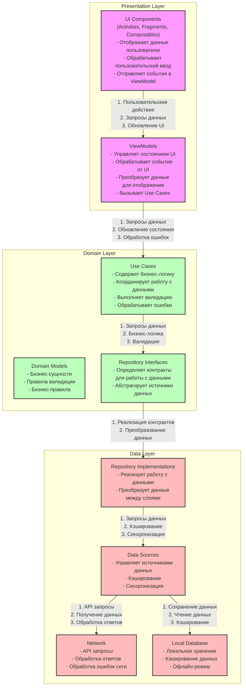

# Архитектура приложения Autohealth

## Описание слоев и взаимодействий

### Presentation Layer (Слой представления)

#### UI Components
- **Входные данные**: 
  - События пользовательского ввода
  - Состояние UI от ViewModel
- **Выходные данные**:
  - Пользовательские действия
  - Запросы на обновление данных
- **Функциональность**:
  - Отображение данных пользователю
  - Обработка пользовательского ввода
  - Навигация между экранами
  - Обработка жизненного цикла компонентов

#### ViewModels
- **Входные данные**:
  - События от UI
  - Данные от Use Cases
  - Состояние приложения
- **Выходные данные**:
  - Состояние UI
  - События для Use Cases
- **Функциональность**:
  - Управление состоянием UI
  - Преобразование данных для отображения
  - Обработка ошибок
  - Кэширование UI-состояния

### Domain Layer (Доменный слой)

#### Use Cases
- **Входные данные**:
  - Запросы от ViewModel
  - Данные от репозиториев
- **Выходные данные**:
  - Результаты бизнес-операций
  - Ошибки валидации
- **Функциональность**:
  - Выполнение бизнес-логики
  - Валидация данных
  - Координация работы с данными
  - Обработка бизнес-ошибок

#### Domain Models
- **Входные данные**:
  - Сырые данные из репозиториев
- **Выходные данные**:
  - Валидированные бизнес-сущности
- **Функциональность**:
  - Определение структуры данных
  - Валидация бизнес-правил
  - Преобразование данных

#### Repository Interfaces
- **Входные данные**:
  - Запросы от Use Cases
- **Выходные данные**:
  - Абстрактные операции с данными
- **Функциональность**:
  - Определение контрактов для работы с данными
  - Абстракция источников данных

### Data Layer (Слой данных)

#### Data Sources
- **Входные данные**:
  - Запросы от репозиториев
  - Данные из сети
  - Данные из локальной БД
- **Выходные данные**:
  - Объединенные данные
  - Кэшированные данные
- **Функциональность**:
  - Управление источниками данных
  - Кэширование
  - Синхронизация данных

#### Repository Implementations
- **Входные данные**:
  - Запросы от Use Cases
  - Данные из Data Sources
- **Выходные данные**:
  - Преобразованные данные
  - Результаты операций
- **Функциональность**:
  - Реализация работы с данными
  - Преобразование данных между слоями
  - Обработка ошибок данных

#### Network
- **Входные данные**:
  - API запросы
  - Параметры запросов
- **Выходные данные**:
  - Ответы API
  - Ошибки сети
- **Функциональность**:
  - Выполнение сетевых запросов
  - Обработка ответов
  - Управление сессиями
  - Обработка ошибок сети

#### Local Database
- **Входные данные**:
  - Данные для сохранения
  - Запросы на чтение
- **Выходные данные**:
  - Сохраненные данные
  - Результаты запросов
- **Функциональность**:
  - Локальное хранение данных
  - Кэширование
  - Поддержка офлайн-режима

## Принципы архитектуры
1. Чистая архитектура с разделением на слои
2. Dependency Injection для управления зависимостями
3. Single Responsibility Principle
4. Repository Pattern для абстракции источников данных
5. MVVM паттерн в Presentation Layer 