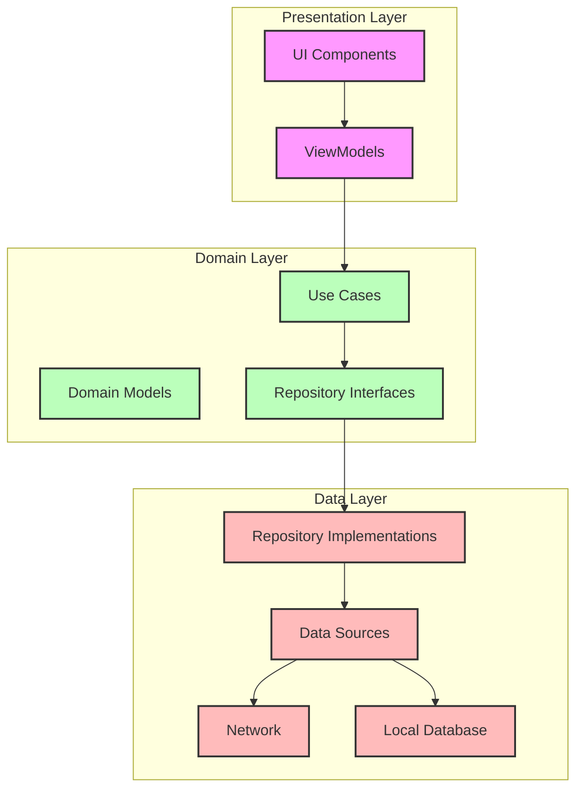

# Архитектура приложения Autohealth

## Описание слоев

### Presentation Layer (Слой представления)
- **UI Components**: Компоненты пользовательского интерфейса (Activities, Fragments, Composables)
- **ViewModels**: ViewModels для управления состоянием UI и обработки пользовательских действий

### Domain Layer (Доменный слой)
- **Use Cases**: Бизнес-логика приложения
- **Domain Models**: Основные модели данных
- **Repository Interfaces**: Интерфейсы для работы с данными

### Data Layer (Слой данных)
- **Data Sources**: Источники данных (локальные и удаленные)
- **Repository Implementations**: Реализации репозиториев
- **Network**: Сетевой слой для работы с API
- **Local Database**: Локальное хранилище данных

## Принципы архитектуры
1. Чистая архитектура с разделением на слои
2. Dependency Injection для управления зависимостями
3. Single Responsibility Principle
4. Repository Pattern для абстракции источников данных
5. MVVM паттерн в Presentation Layer 